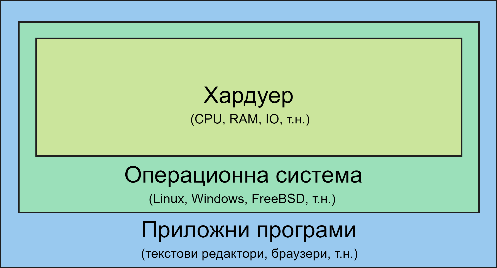

# Тема 1: История и структура на компютърните системи

1. Кратка история на компютърните системи
    - 19-ти век
        - Първоначално Чарлз Бабидж разработва "разностно устройство", което може да се разглежда като механичен калкулатор
        - След това проектира и се опитва да построи "аналитично устройство" през 1837 г.
        - Реализиран е няколко години по-късно през 1841 г.
        -  
        Аналитично устройство на Чарлз Бабидж

    - 1940-те г.
        - Първите електронни компютри
        - Рабързаният прогрес се дължи на напредъка на електронни компоненти през 30-те години (релета, вакумни лампи, кондензатори) и Втората световна война
        - Програмират се с перфокарти
        - Fun fact: първият компютърен бъг е открит 1947 г. и е бил... истинска бубoлечка
         
        Fun fact: първият компютърен бъг е открит 1947 г. и е бил... истинска бубoлечка

    - 1950-те г.
        - Започват да се използват транзистори вместо вакумни лампи
        - Има няколко проблема с компютърните системи:
            - всяка програма трябва да се пише за конкретния модел машина върху който ще се изпълнява
            - също така, програмата трябва да работи директно с хардуерните ресурси, без никаква абстракция 
        - Първата операционна система - GMOS
            - Разработена от General Motors за IBM 701
        - Първият публично достъпен програмен език - Fortran
    
    - 1960-те г.
        - Първите интегрални схеми – микрочипове, като компютри, които ги използват се появяват през 1963 г.
        - Многозадачност - в оперативната памет едновременно се намират няколко задания; когато някое от заданията чака за изпълнение на входно/изходна операция, процесорът може да премине към обработване на друго задание
        - Времеделение - времето на процесора се разделя между всички потребители
        - Началото на работа по Unix - 1969 г.

    - 1970-те г.
        - Започва ерата на персоналните компютри
        - Първият прототип на графичен потребителски интерфейс (GUI)
            - Разработен от Xerox Palo Alto Research Center през 1979 г.
            - Стив Джобс, търсейки нови идеи за работа в бъдещи итерации на Apple компютрите, дава 1 мил. долара акции на Xerox, в замяна за подробна обиколка на техните съоръжения и текущи проекти.

    - 1980-те г.
        - MS DOS (1981 г.), Microsoft Windows 1.0 (1985 г.)
        - Apple Lisa (1983 г.) - първият компютър на Apple с мишка и GUI
    
    - 1990-те г.
        - NeXTStep (1991 г.) операционната система, която по-късно става macOS
        - Linux (1991 г.)
            - "I'm doing a (free) operating system (just a hobby, won't be a big and professional like gnu)" - Линус Торвалдс
            - [Why so many distros? The Weird History of Linux - Fireship](https://youtu.be/ShcR4Zfc6Dw)

2. Какво е операционна система?
     
    Фиг. 2.1.: Обща структура на компютърна система

    - За жалост, няма общоприета конкретна дефиниция за ОС.
    - Операционната система контролира хардуера на системата.
    - Също така предоставя недиректен достъп на програмите към хардуера
        - Операционната система предоставя съвкупност от функции, които програмите могат да използват
        - Пример: Програмата няма директен достъп за писане и четене върху харддиска на машината, но може да ги използва с функциите `read()`, `write()` и т.н.
        - Ще се запознаем с това по-подробно на първото практическо упражнение

3. Какво представлява хардуера на една компютърна система?
     
    Фиг. 3.1.: Пример за структура на хардуера на компютърна система

    Всяка компютърна система съдържа следните 4 компонента:
    - Централен процесор (CPU)
        - Изпълнява инструкии, обработва данни, изчислява
        - Чрез него ОС контролира останалите компоненти

    - Оперативна памет (RAM)
        - Памет върху която можем да записваме информация и да я четем
        - Използва се за запазване на иструкции към процесора и данни на приложните програми/операционната система (малко по-подробно в следващата точка)
        - Енергозависима - информацията не се пази при изключване на системата

    - Входно/Изходни устройства (IO Devices)
        - Устройства, с които операционната система може да комуникира - да изпраща информация към тях или да получава информация от тях.
        - Примери за входно-изходни устройства са мишките, принтерите, мониторите, записващите устройства, като HDD, SSD и т.н.
        - В частност ще разгледаме записващите устройства:
            - Енергонезависима - информацията се запазва, дори и системата да бъде изключена
            - По-бавни и по-обемни от оперативната памет

    - Системна шина (System bus)
        - Компонент чрез който се извършва комуникацията между останалите компоненти

    ОС управлява хардуера и предоставя достъп на програмите чрез API (приложно-програмен интерфейс). Примери:
        - malloc() и free()
        - виртуалната адресна таблица
            - спиране при опит за достъп на памет върху която нямаме право
        - достъпване на файлове с read() и write()
            - файловете имат права за достъп
        - TODO: разпиши по-подробно примерите

4. Какво се случва в процесора?
     
    Фиг. 4.1.: Структура на централния процесор

